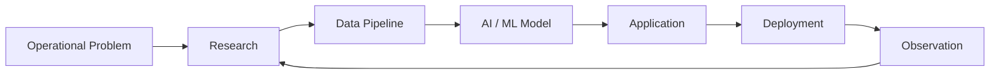

<div align="center">

<!-- ===================================================== -->

<!--                    CONTROL HEADER                     -->

<!-- ===================================================== -->

<pre>
╔══════════════════════════════════════════════════════════════════╗
║                                                                  ║
║                 T A L H A   //   C O N T R O L                   ║
║                                                                  ║
║        AI SYSTEMS · SOFTWARE ENGINEERING · REAL-WORLD OPS         ║
║                                                                  ║
╚══════════════════════════════════════════════════════════════════╝
</pre>

# Talha Sikandar

### AI/ML Engineer · Software Engineer · Systems Builder

**I build intelligent systems that move beyond notebooks—
into products, infrastructure, and real-world operations.**

<br>

[](https://talha-sikandar.vercel.app)
[](https://www.linkedin.com/in/talha-sikandar/)
[](mailto:raotalha396@gmail.com)

</div>

---

## `01 // SYSTEM OVERVIEW`

```yaml
operator:
  name: Talha Sikandar
  role: AI/ML Engineer and Software Engineer
  base: Lahore, Pakistan
  education: BS Computer Science — Information Technology University
  specialization:
    - Industrial AI
    - Machine Learning Systems
    - Full-Stack Engineering
    - MLOps and Model Deployment
    - Linux and Developer Infrastructure

system_state:
  status: ONLINE
  mode: BUILDING
  availability: OPEN_TO_HIGH_IMPACT_WORK

primary_directive:
  "Convert complex operational problems into reliable,
   intelligent and production-ready systems."
```

<table>
<tr>
<td width="50%" valign="top">

### `CURRENT OPERATIONS`

```text
● Designing production AI systems
● Building end-to-end ML pipelines
● Developing intelligent applications
● Experimenting with systems and infrastructure
● Turning research into usable products
```

</td>
<td width="50%" valign="top">

### `ENGINEERING PRINCIPLES`

```text
01. Understand the real problem
02. Build the smallest valid system
03. Measure before optimizing
04. Design for failure
05. Deploy, observe and improve
```

</td>
</tr>
</table>

---

## `02 // LIVE CAPABILITY MATRIX`

```text
Machine Learning       █████████████████░░░  Production Systems
Python Engineering     ██████████████████░░  Primary Language
Full-Stack Systems     ████████████████░░░░  Product Development
Linux & Infrastructure ████████████████░░░░  Daily Environment
MLOps & Deployment     ███████████████░░░░░  Active Development
Systems Programming    ██████████████░░░░░░  Continuous Learning
```

> I am most interested in work where **machine intelligence, software engineering, and real-world operations intersect.**

---

# `03 // MISSION ARCHIVE`

## Mission File `PX-01`

<table>
<tr>
<td width="22%" align="center">

### STATUS

`FIELD DEPLOYED`

### DOMAIN

`INDUSTRIAL AI`

### CLEARANCE

`FLAGSHIP`

</td>
<td width="78%">

## PlungerXcel

**AI-driven closed-loop optimization for plunger-lifted oil and gas wells.**

Traditional well controllers operate using fixed timers and manually configured setpoints. PlungerXcel transforms each production cycle into feedback for the next one.

### Mission objectives

* Process live well telemetry and cycle data
* Evaluate pressure, flow and arrival behavior
* Recommend optimized shut-in and afterflow settings
* Apply operational constraints and safety limits
* Continuously learn from the response of each well

### Operational result

The system has been tested across multiple real production wells and was designed to connect telemetry, machine intelligence and field control in one continuous optimization loop.

### Technology signal

`Python` `Machine Learning` `Time Series` `Optimization`
`FastAPI` `React` `Go` `Kafka` `InfluxDB` `AWS`

[View the product system →](https://www.plungerlift.qult.ai)

</td>
</tr>
</table>

---

## Mission File `PM-02`

<table>
<tr>
<td width="22%" align="center">

### STATUS

`PROTOTYPE ACTIVE`

### DOMAIN

`PREDICTIVE AI`

### TARGET

`ROTATING ASSETS`

</td>
<td width="78%">

## Predictive Maintenance Intelligence

**An AI-assisted monitoring and diagnostic system for industrial pumps and mixers.**

The system is designed to move beyond basic dashboards by connecting condition monitoring with fault interpretation and maintenance guidance.

### Mission objectives

* Analyze vibration, RPM and temperature telemetry
* Identify abnormal operating patterns
* Detect likely mechanical fault categories
* Estimate machine health and failure risk
* Present actionable maintenance recommendations

### Monitored failure modes

`Bearing Faults` · `Misalignment` · `Unbalance`
`Mechanical Looseness` · `Cavitation` · `Lubrication Issues`

### Engineering references

`ISO 20816` `API 610` `API 670`
`FFT Analysis` `Anomaly Detection` `ThingsBoard`

</td>
</tr>
</table>

---

## Mission File `ML-03`

<table>
<tr>
<td width="22%" align="center">

### STATUS

`RESEARCH COMPLETE`

### DOMAIN

`DEEP LEARNING`

### BUILD TYPE

`FROM SCRATCH`

</td>
<td width="78%">

## MegaMan-CO

**A custom Long Short-Term Memory network implemented in pure Python for next-day stock-price prediction.**

Rather than relying entirely on high-level deep-learning abstractions, this project explores the internal mechanics of recurrent neural networks.

### Systems investigated

* Recurrent state propagation
* LSTM gates and memory cells
* Forward and backward propagation
* Sequence preprocessing
* Time-series prediction
* Model evaluation

[Inspect the mission repository →](https://github.com/TalhaSikandar/megaman-co)

</td>
</tr>
</table>

---

## Mission File `SYS-04`

<table>
<tr>
<td width="22%" align="center">

### STATUS

`ALWAYS EVOLVING`

### DOMAIN

`LINUX SYSTEMS`

### ENVIRONMENT

`PERSONAL LAB`

</td>
<td width="78%">

## Developer Environment and Dotfiles

**A version-controlled Linux development environment built for speed, consistency and experimentation.**

The repository contains personal system configurations used to reproduce and manage development environments across Linux systems.

### Mission objectives

* Automate workstation configuration
* Preserve reproducible development environments
* Improve terminal-centered workflows
* Experiment with Linux tools and window management
* Reduce setup time across machines

[Enter the configuration repository →](https://github.com/TalhaSikandar/dotfiles)

</td>
</tr>
</table>

---

# `04 // OPERATOR MODEL CARD`

```text
┌──────────────────────────────────────────────────────────────────┐
│ MODEL NAME        TalhaSikandar                                  │
│ MODEL FAMILY      Engineer / Researcher / Product Builder         │
│ VERSION           2026.07                                        │
│ DEPLOYMENT        Lahore, Pakistan                                │
│ CURRENT STATE     Actively learning and building                  │
└──────────────────────────────────────────────────────────────────┘
```

### Model description

`TalhaSikandar` is a production-oriented engineering model trained to work across the complete lifecycle of an intelligent system:



### Intended use

```diff
+ Building production-grade AI and ML systems
+ Developing full-stack intelligent applications
+ Transforming ambiguous ideas into working products
+ Designing industrial monitoring and optimization systems
+ Creating reliable data and inference pipelines
+ Solving unfamiliar technical problems through research
```

### Training distribution

| Knowledge domain              | Approximate allocation |
| ----------------------------- | ---------------------: |
| Building and debugging        |                  `35%` |
| AI and machine learning       |                  `25%` |
| Software and system design    |                  `20%` |
| Research and experimentation  |                  `15%` |
| Renaming variables repeatedly |                   `5%` |

### Known behaviors

```text
[+] Questions assumptions before implementing
[+] Enjoys understanding systems below the abstraction layer
[+] Prefers working prototypes over endless presentations
[+] Treats deployment as part of engineering—not an afterthought
[+] May attempt to automate a task after performing it twice
```

### Current limitations

```text
[-] Can spend too long perfecting development environments
[-] Occasionally turns a small experiment into a complete platform
[-] Frequently opens one more terminal than strictly necessary
[-] Performance may correlate with available coffee
```

---

# `05 // TECHNOLOGY MODULES`

<div align="center">

### Intelligence Layer


### Application Layer


### Systems Layer


### Data and Infrastructure


</div>

---

# `06 // ENGINEERING PIPELINE`

```text
                           TALHA ENGINEERING LOOP

     ┌───────────────┐
     │   DISCOVER    │
     │ Find the real │
     │    problem    │
     └───────┬───────┘
             │
             ▼
     ┌───────────────┐
     │   RESEARCH    │
     │ Data, systems │
     │  constraints  │
     └───────┬───────┘
             │
             ▼
     ┌───────────────┐
     │   PROTOTYPE   │
     │ Test the core │
     │  assumption   │
     └───────┬───────┘
             │
             ▼
     ┌───────────────┐
     │    ENGINEER   │
     │ Build reliable│
     │   software    │
     └───────┬───────┘
             │
             ▼
     ┌───────────────┐
     │    DEPLOY     │
     │ Connect model │
     │ and operation │
     └───────┬───────┘
             │
             ▼
     ┌───────────────┐
     │    OBSERVE    │
     │ Measure, learn│
     │  and improve  │
     └───────┴───────┘
```

---

# `07 // CURRENT RESEARCH QUEUE`

```python
current_focus = {
    "industrial_ai": [
        "closed-loop optimization",
        "predictive maintenance",
        "time-series intelligence",
    ],
    "machine_learning": [
        "model evaluation",
        "adaptive systems",
        "real-time inference",
    ],
    "software_engineering": [
        "distributed systems",
        "production architecture",
        "developer infrastructure",
    ],
    "exploration": [
        "AI agents",
        "GPU orchestration",
        "low-level systems",
    ],
}
```

---

# `08 // TELEMETRY`

<div align="center">


<br>


</div>

> GitHub language statistics describe public repository composition—not the complete range or depth of my engineering experience.

---

# `09 // CONNECTION PROTOCOL`

```bash
$ ./find-collaborator \
    --skills "AI/ML, software engineering, industrial systems" \
    --mindset "curious, practical, impact-driven"

Searching...

MATCH FOUND
Name: Talha Sikandar
Status: Available for meaningful engineering challenges
```

I am interested in opportunities involving:

* Production AI and machine-learning engineering
* Industrial automation and intelligent monitoring
* Full-stack AI products
* MLOps, infrastructure and model deployment
* Research-oriented software engineering
* Challenging systems that require learning beyond familiar tools

<div align="center">

### Have a difficult problem worth solving?

[](https://www.linkedin.com/in/talha-sikandar/)

<br><br>

```text
SYSTEM MESSAGE:
The best projects begin with an interesting problem.
```

<sub>Designed as an engineering control room—not a conventional résumé.</sub>

</div>
